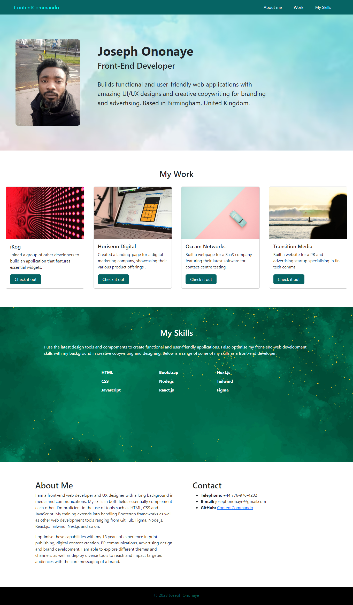

# Bootstrap-Portfolio
This is version 2.0 of my portfolio page, built as an improvement on the previous one.
I have used components from Bootstrap for an easier design process. The frameworks used are, of course, 
complemented with a good deal of custom styling using CSS. Javascript CDN was also included 
in my HTML structure to essentially allow for optimised functionality of the application.

Click this [link](https://contentcommando.github.io/Bootstrap-Portfolio/) to view the application. 

## Mock-up

## Design Process
1. **Folder Structure:** I began the design process by creating the folder structure of the project. I cloned the repository with its read.me file, collated all the images required into an assets subfolder and created the relevant files for HTML structure and custom CSS styling.

2. **Review of Old Portfolio:** I reviewed the previous portfolio page I had created and used it as a guide to sketch the structure of this new project.

3. **Bootstrap Integration:** I embedded the relevant code snippets for Bootstrap in the head and body of my HTML file.

4. **Custom CSS File:** I also included a CSS link into my HTML file to allow me customise the Bootstrap frameworks I would be using.

5. **Building Structure:** The structure of the application was built essentially with a combination of Bootstrap frameworks and self-written codes. A good part of the application required me to write out codes personally.

6. **Styling:** I used selectors extensively to make sure the application is not "Bootstrapy", overwriting the source codes in a few cases with *!Important*

7. **Commits:** I made sure to commit as often as possible at different stages of the project.

## Features
1. **Navigation Bar:** The application features a navigation bar that has my GitHub username as a brand item, as well as a menu of links that jump to different sections of the application; namely:
    *   My Work
    *   My Skills
    *   About Me
    *   Contact

2. **Hero:** Next, the application features a hero with my photo, name, title and a short intro of who I am.

3. **My Work:** This section showcases projects that I worked on previously. I used cards to depict each project image, title and short description, with a button to allow users find out more.

4. **My Skills:** The next section lists skills I have acquired as a front-end web developer, helping users have a good glance at my range of capabilities.

5. **About Me & Contact Info:** I used this section to give users more information about myself. My interest as a front-end developer and my background in creative copywriting, and how I leverage these two sides of my career.

## Challenges
Every project of mine has come with peculiar challenges. The most remarkable one in this project has to do with the responsiveness of cards after inserting images. I spent a long time trying to figure out why the images would overlap rather than display distinctly with gutters. I was able to find and fix the bug after reading many resources.

## What's Next?
I hope to upload more of my projects onto this application, improve its look amd feel and add links to my socials to make it more integrated.

